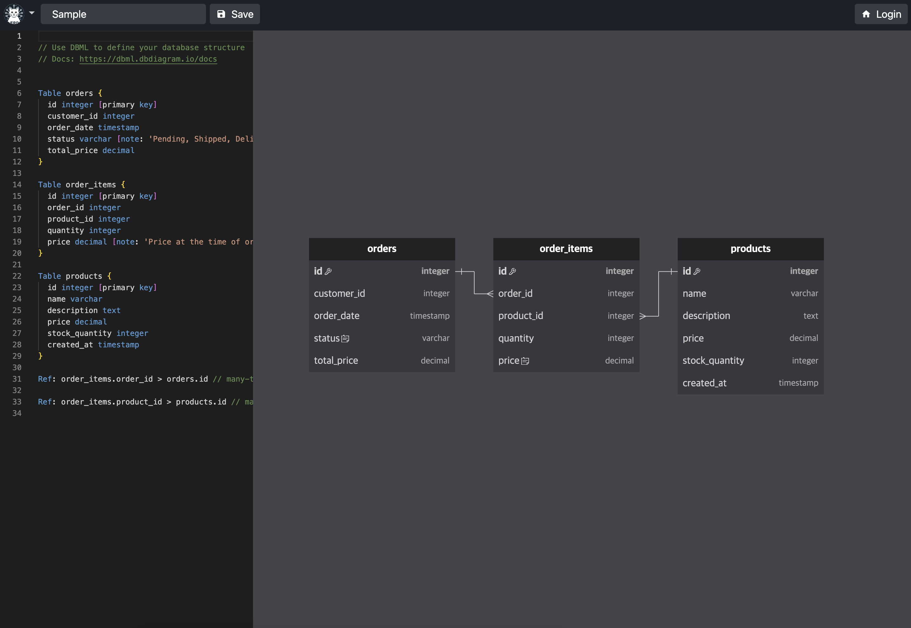

# Easy RD - Interactive Database Schema Designer

Easy RD is an open-source, web-based database schema designer that makes creating and sharing Entity-Relationship Diagrams effortless. Built with modern web technologies, it provides a seamless experience for database design and collaboration.

🚀 **Live Service**: [https://easyrd.dev](https://easyrd.dev)



## ✨ Features

- 📝 **DBML Editor**: Write database schemas using DBML (Database Markup Language) with full syntax highlighting and auto-completion
- 🎨 **Real-time Visualization**: See your database diagram update instantly as you type
- 🔗 **Shareable Projects**: Share your diagrams with others via unique URLs
- 👥 **Collaboration**: Invite team members to view or edit your diagrams
- 🔒 **Permission Management**: Fine-grained control over who can view, edit, or manage your projects
- 📱 **Responsive Design**: Works seamlessly on desktop and mobile devices
- 🌐 **Resource Adapter Pattern**: Flexible data source abstraction - use databases, APIs, or any backend

## 🛠️ Tech Stack

### Core Technologies

- **Framework**: [SvelteKit](https://kit.svelte.dev/) - Fast, modern web framework
- **Language**: TypeScript - Type-safe development
- **Styling**: Tailwind CSS - Utility-first CSS framework
- **Authentication**: [Auth.js](https://authjs.dev/) - Flexible authentication for web apps

### Key Dependencies

#### 🎨 Diagram Rendering - Flitter
- **Library**: [@meursyphus/flitter](https://github.com/meursyphus/flitter) & @meursyphus/flitter-svelte
- **Purpose**: Provides a Flutter-like widget system for building complex UI layouts
- **Usage**: Powers the interactive database diagram visualization with draggable tables and connections
- **Organization**: Both Easy RD and Flitter are part of the [Meursyphus](https://github.com/meursyphus) organization, sharing the same vision for modern web development tools

#### 📝 Database Schema Language - DBML
- **Library**: [@dbml/core](https://www.dbml.org/)
- **Purpose**: Database Markup Language parser for defining database schemas
- **Features**: 
  - Human-readable syntax for database design
  - Supports tables, relationships, indexes, and more
  - Converts DBML to SQL or other formats

#### 💻 Code Editor - Monaco Editor
- **Library**: [monaco-editor](https://microsoft.github.io/monaco-editor/)
- **Purpose**: Powers the DBML code editor with VS Code-like features
- **Features**:
  - Syntax highlighting for DBML
  - Auto-completion
  - Error highlighting
  - Code folding

### Data Layer

- **ORM**: [Drizzle ORM](https://orm.drizzle.team/) - Type-safe SQL query builder
- **Database Abstraction**: Resource Adapter pattern supporting:
  - Cloudflare D1 (default)
  - PostgreSQL
  - MySQL
  - REST APIs
  - GraphQL endpoints
  - Any custom data source

### Infrastructure

- **Deployment**: Cloudflare Pages
- **Database**: Cloudflare D1 (SQLite at the edge)
- **Edge Runtime**: Cloudflare Workers

## 🚀 Getting Started

### Prerequisites

- Node.js 18+ and npm
- A database (Cloudflare D1, PostgreSQL, MySQL, or SQLite)
- OAuth credentials (GitHub, Google, etc.)

### Installation

1. Clone the repository:
   ```bash
   git clone https://github.com/meursyphus/easy-rd.git
   cd easy-rd
   ```

2. Install dependencies:
   ```bash
   npm install
   ```

3. Set up environment variables:
   ```bash
   cp .env.example .env
   ```
   
   Edit `.env` and configure:
   - `AUTH_SECRET`: Generate with `openssl rand -base64 32`
   - `OAUTH_CREDENTIALS`: Your OAuth provider credentials
   - Database connection (see database setup below)

4. Set up the database:
   ```bash
   # First, check current migration status
   npm run migration:list
   
   # Generate new migrations if schema changes
   npm run migration:generate
   
   # Apply migrations to local D1 database
   npm run migration:apply
   ```

5. Run the development server:
   ```bash
   npm run dev
   ```

Visit `http://localhost:5173` to see the application.

## 🏗️ Architecture

### Resource Adapter Pattern

Easy RD uses a flexible Resource Adapter pattern that abstracts data operations, allowing you to use any backend:

```typescript
// Use the default Drizzle adapter with Cloudflare D1
const adapter = new DrizzleAdapter(db);

// Or create your own adapter for REST APIs
const adapter = new APIAdapter({ 
  apiUrl: 'https://api.your-backend.com' 
});

// Or use GraphQL
const adapter = new GraphQLAdapter({ 
  endpoint: 'https://graphql.your-backend.com' 
});
```

See [Resource Adapters Documentation](docs/resource-adapters.md) for implementation details.

### Project Structure

```
src/
├── lib/
│   ├── api/          # API client
│   ├── auth/         # Authentication setup
│   ├── components/   # Reusable components
│   │   ├── diagram/  # Flitter-based diagram components
│   │   ├── editor/   # Monaco editor wrapper
│   │   └── ...
│   ├── dbml/         # DBML parser and types
│   ├── server/       # Server-side code
│   │   ├── adapter/  # Resource adapter implementations
│   │   └── ...
│   └── ui/           # UI components
├── routes/           # SvelteKit routes
└── stories/          # Storybook stories
```

## 🔧 Configuration

### Authentication

Easy RD uses Auth.js for authentication. Currently supports:
- GitHub OAuth
- Google OAuth
- More providers can be easily added

See [src/lib/auth/README.md](src/lib/auth/README.md) for detailed setup.

### Database Adapters

The project supports multiple data sources through the Resource Adapter pattern:
- **Drizzle + D1** (default)
- **REST API**
- **GraphQL**
- **Custom implementations**

See [docs/resource-adapters.md](docs/resource-adapters.md) for details.

## 📚 Documentation

- [Resource Adapters](docs/resource-adapters.md) - How to implement custom data sources
- [Authentication Setup](src/lib/auth/README.md) - Configure OAuth providers
- [Migration Guide](docs/migration-guide.md) - Upgrading from older versions

## 🛠️ Development

### Available Scripts

- `npm run dev` - Start development server
- `npm run build` - Build for production
- `npm run preview` - Preview production build
- `npm run check` - Run type checking
- `npm run lint` - Run linter
- `npm run format` - Format code
- `npm run storybook` - Start Storybook for component development

### Database Management

#### Migration Commands

- `npm run migration:generate` - Generate new database migrations from schema changes
- `npm run migration:list` - List current migration status (local D1 database)
- `npm run migration:list-prod` - List current migration status (production D1 database)
- `npm run migration:apply` - Apply pending migrations to local D1 database
- `npm run migration:apply-prod` - Apply pending migrations to production D1 database

#### Migration Workflow

1. **Check Status**: Always start by checking what migrations exist
   ```bash
   npm run migration:list
   ```

2. **For Schema Changes**: When you modify `src/lib/server/entity/index.ts`
   ```bash
   npm run migration:generate
   npm run migration:apply
   ```

3. **For Production**: Deploy migrations to production
   ```bash
   npm run migration:list-prod  # Check production status
   npm run migration:apply-prod # Apply to production
   ```

**Note**: Local development uses Cloudflare D1 in local mode, while production uses the remote D1 database specified in `wrangler.toml`.

## 🚀 Deployment

Easy RD is deployed on Cloudflare Pages with D1 database. The production site is available at [https://easyrd.dev](https://easyrd.dev).

### Deploy Your Own Instance

1. Fork this repository
2. Create a Cloudflare account
3. Set up a D1 database
4. Configure environment variables in Cloudflare Pages
5. Deploy with Wrangler or connect GitHub repository

See detailed deployment instructions in the [Cloudflare documentation](https://developers.cloudflare.com/pages/framework-guides/deploy-a-svelte-site/).

## 🤝 Contributing

We welcome contributions! Whether it's bug fixes, new features, or documentation improvements.

1. Fork the repository
2. Create your feature branch (`git checkout -b feature/amazing-feature`)
3. Commit your changes (`git commit -m 'Add some amazing feature'`)
4. Push to the branch (`git push origin feature/amazing-feature`)
5. Open a Pull Request

### Development Guidelines

- Write tests for new features
- Follow the existing code style
- Update documentation as needed
- Add examples for new functionality

## 📄 License

This project is licensed under the MIT License - see the [LICENSE](LICENSE) file for details.

## 🙏 Acknowledgments

- [DBML](https://www.dbml.org/) - For the excellent database markup language
- [@meursyphus/flitter](https://github.com/meursyphus/flitter) - For the Flutter-inspired layout system
- [Monaco Editor](https://microsoft.github.io/monaco-editor/) - For the powerful code editor
- [SvelteKit](https://kit.svelte.dev/) - For the amazing web framework
- [Drizzle ORM](https://orm.drizzle.team/) - For the type-safe database toolkit
- [Cloudflare](https://cloudflare.com/) - For the edge computing platform

## 🔗 Links

- **Live Service**: [https://easyrd.dev](https://easyrd.dev)
- **Source Code**: [GitHub Repository](https://github.com/meursyphus/easy-rd)
- **Discord Community**: [Join our Discord](https://discord.gg/n8dffUVbtp)
- **Report Issues**: [GitHub Issues](https://github.com/meursyphus/easy-rd/issues)
- **Organization**: [Meursyphus on GitHub](https://github.com/meursyphus) - Home to Easy RD, Flitter, and other modern web tools

---

Made with ❤️ by the Easy RD community